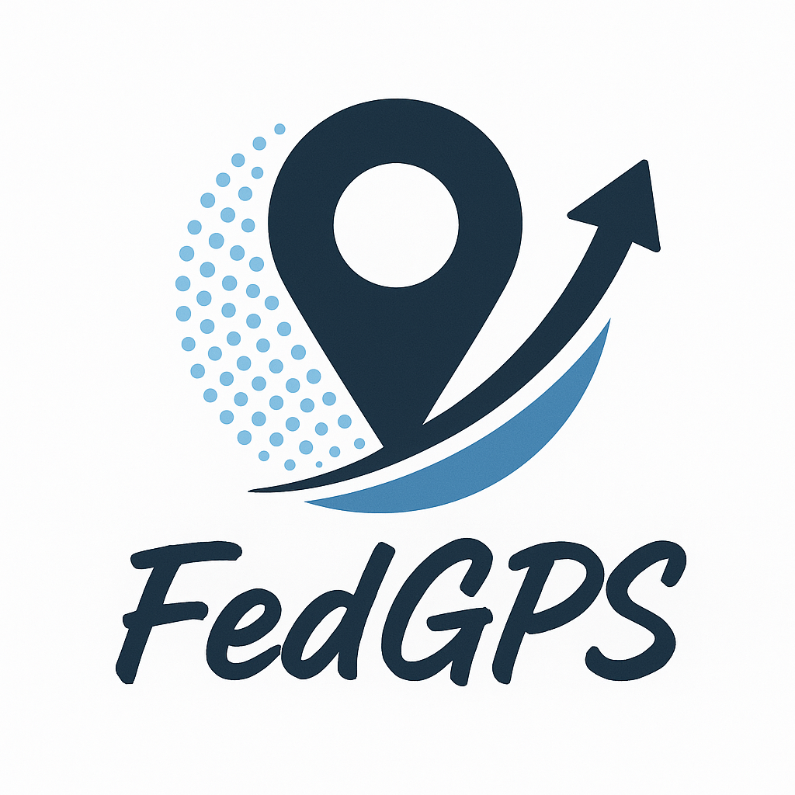

    

    
    
    
    

<h1 align="center">FedGPS: Statistical Rectification Against Data Heterogeneity in Federated Learning  (NeurIPS 2025)</h1>

[Zhiqin Yang](https://visitworld123.github.io/), [Yonggang Zhang](https://yonggangzhangben.github.io/index.html), [Chenxin Li](https://chenxinli001.github.io/), 
[Yiu-ming Cheung](https://www.comp.hkbu.edu.hk/~ymc/), [Bo Han](https://bhanml.github.io/), [Yixuan Yuan](http://www.ee.cuhk.edu.hk/~yxyuan/)

**Keywords**: Goal-Path Synergy, Statistical Rectification, Data Heterogeneity, Federated Learning

**Abstract**: Federated Learning (FL) confronts a significant challenge known as data heterogeneity, which impairs model performance and convergence. Existing methods have made notable progress in addressing this issue. However, improving performance in certain heterogeneity scenarios remains an overlooked question: _How
robust are these methods to deploy under diverse heterogeneity scenarios?_ To answer this, we conduct comprehensive evaluations across varied heterogeneity scenarios, showing that most existing methods exhibit limited robustness. Meanwhile, insights from these experiments highlight that sharing statistical information
can mitigate heterogeneity by enabling clients to update with a global perspective. Motivated by this, we propose FedGPS (**Fed**erated **G**oal-**P**ath Synergy), a novel framework that seamlessly integrates statistical distribution and gradient information from others. Specifically, FedGPS statically modifies each client’s learning objective to implicitly model the global data distribution using surrogate information, while dynamically adjusting local update directions with gradient information from other clients at each round. Extensive experiments show that FedGPS outperforms state-of-the-art methods across diverse heterogeneity scenarios, validating its effectiveness and robustness. 

## The Table of Contents
- [:grimacing: Dependencies and installation](#grimacing-dependencies-and-installation)
- [:partying\_face: How to run:](#partying_face-how-to-run)
- [:gem: Extension based on our code](#gem-extension-based-on-our-code)
  - [:book: Main code structure](#book-main-code-structure)
  - [:jigsaw: How to extend based on our code](#jigsaw-how-to-extend-based-on-our-code)
- [:rose: Experimental results](#rose-experimental-results)
- [:smiley: Citation](#smiley-citation)
- [:closed\_book: License](#closed_book-license)
- [:smiling\_face\_with\_three\_hearts: Acknowledgement](#smiling_face_with_three_hearts-acknowledgement)
- [:phone: Contact](#phone-contact)

:wink: If FedGPS is helpful to you, please star this repo. Thanks! :hugs: 

## :smiley: Citation
If our work is useful for your research, please consider citing:

    @inproceedings{
        yang2025fedgps,
        title={FedGPS: Statistical Rectification Against Data Heterogeneity in Federated Learning},
        author={Yang, Zhiqin and Zhang, Yonggang and Li, Chenxin and Cheung, Yiu-ming and Han, Bo and Yuan, Yixuan},
        booktitle={Thirty-Ninth Conference on Neural Information Processing Systems},
        year={2025}
    }

## :closed_book: License

This project is licensed under <a rel="license" href=""> MIT</a>. Redistribution and use should follow this license.

## :smiling_face_with_three_hearts: Acknowledgement

This project is partly based on [VHL](https://github.com/wizard1203/VHL) and [FedLESAM](https://github.com/MediaBrain-SJTU/FedLESAM). 

This Readme follows the [FedFed](https://github.com/visitworld123/FedFed) style. 

## :phone: Contact
If you have any questions, please feel free to reach me out at `yangzqccc@gmail.com`. 

## Star History

